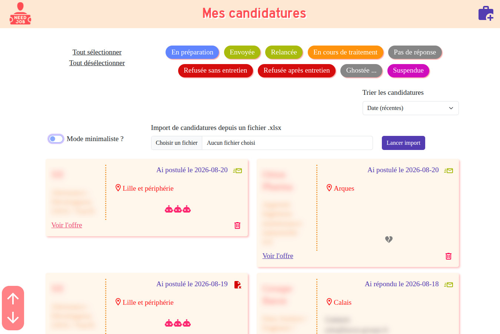
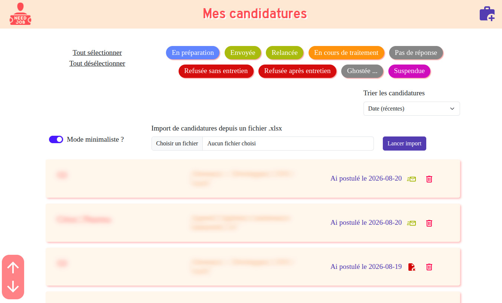
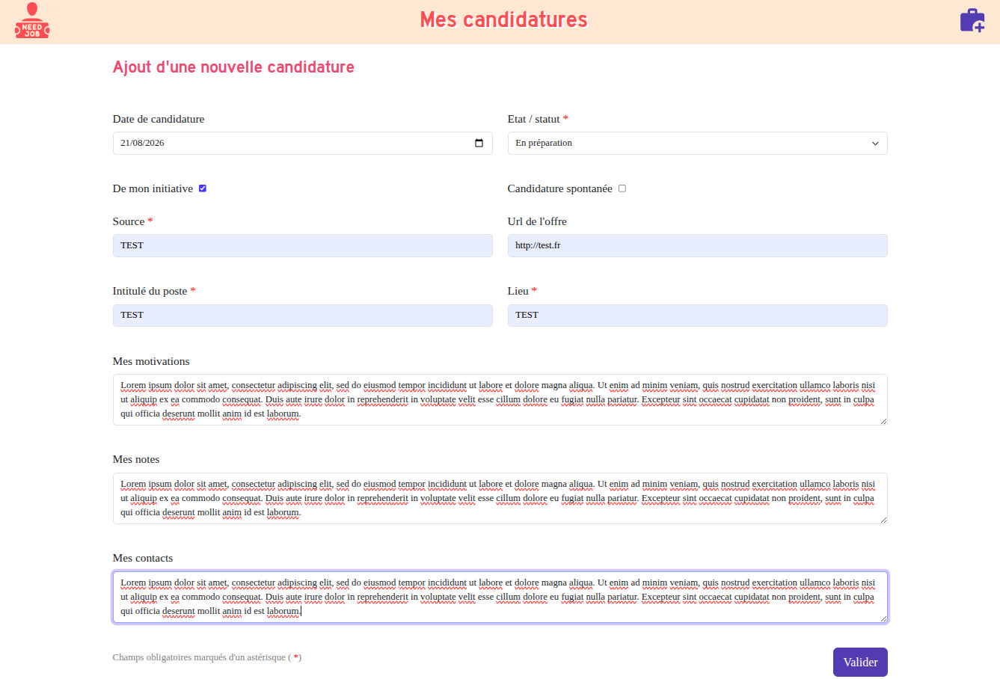
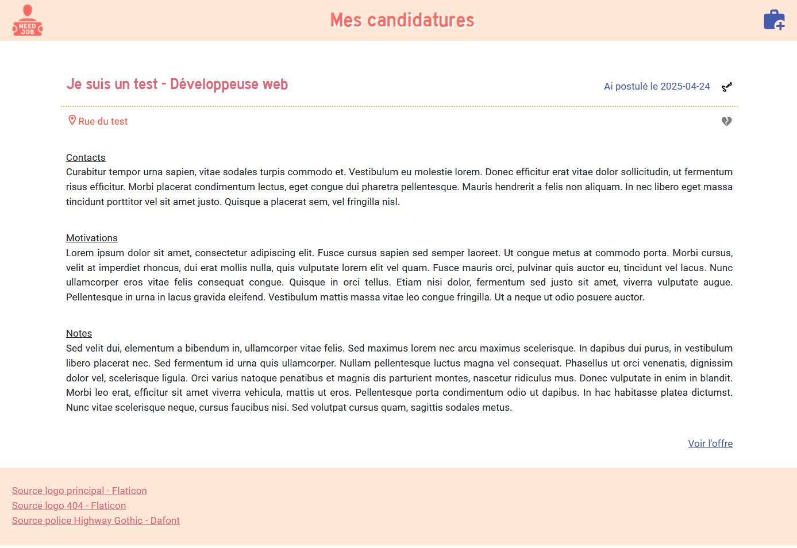

# 🚀️👀️ Application front-end pour gérer mes candidatures 👀️🚀️

Commençant à accumuler les candidatures lors de ma recherche d'emploi, j'ai fini par me dire : "Hey ! Pourquoi ne pas développer ma propre application pour gérer mes candidatures, tout en apprenant React.js et TypeScript ?".

A ce stade, l'application permet de gérer toutes les candidatures présentes dans la base de données (de type SQL Server), sans notion d'utilisateur. Il est possible d'importer un ensemble de candidatures à partir d'un fichier au format .xlsx.

La gestion de comptes utilisateurs sera ajoutée plus tard.

---

## 1. Descriptif des variables d'environnement nécessaires

| Nom                       | Descriptif                                                |
| ------------------------- | --------------------------------------------------------- |
| VITE_APP_DATA_SOURCE_FILE | Nom du fichier TypeScript dont les données sont extraites |
| VITE_APP_API_BASE_URL     | Url de base de l'API qui donne accès aux données          |

## 2. Quelques captures d'écran :) 👍

